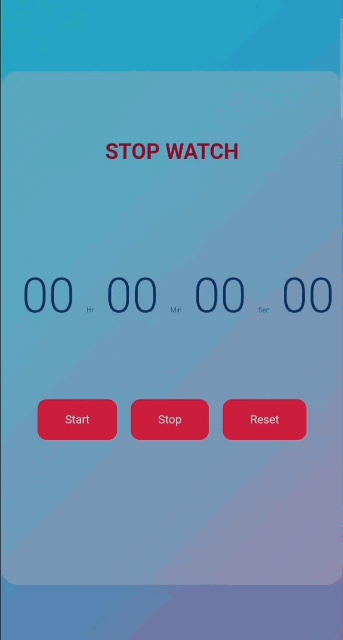

<h1>Stopwatch</h1>

Stopwatch project is developed using JavaScript, CSS, and HTML. Useful for calculating time in any work.

The user can start the timer for any work and stop or reset as per their wish.

You just have to click on the ‘Start’ to start the watch timer while click on the ‘stop’ to pause.

<h2>Demo</h2>

